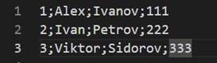
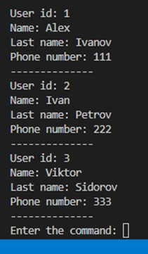
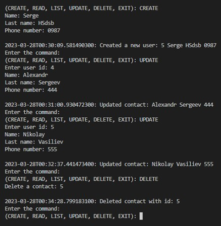
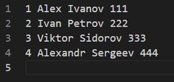

***Home Work 5: От простого к практике. Cправочник пользователей.***

1. В классе UserRepository добавлен и описан метод delete() для удаления контакта из списка.

2. В классе UserController добавлен метод deleteUser(), который вызывает метод delete().

3. В классе UserMapper создал конструктор, в котором можно изменить формат записи контактов в список, например через ";".

4. В классе User изменил мотод toString(), изменил формат вывода данных в консоль, через разделитель. 

5. В классе UserView описал поведение при команде DELETE:вызывается метод deleteUser() из контроллера, в свою очередь контроллер вызывает метод delete() из класса UserRepository.

6. В классе UserView создал метод userContact() для получения данных нового контакта и замены действующего контакта в записной книжке.

***Home Work 7: Cправочник пользователей.***

1. Добавил пакет file, поместил туда интерфейс Operation и класс FileOperation для работы с файлами БД.

2. Добавил пакет log, внутри него добавил интерфейс Logger имплементировал его классу ConsoleLogger. В классе UserController добавил логирование методам saveUser(), userUpdate(), deleteUser().

3. В классе Main вызвал Logger. 

4. Изменил формат записи в файл

